<h1 align="center">智远云客 AI 智能客服系统</h1>

<div align="center">


**新一代号卡流量卡 AI 智能客服系统 | 流式响应 | 知识库管理 | 多版本销售**

[Demo 演示](http://598.zhiyuantongxin.com) · [功能介绍](#-功能特点) · [安装部署](#-安装部署) · [联系客服](#-联系客服)

</div>

---

## ✨ 项目简介

智远云客 AI 智能客服系统是一款基于 AI 大模型的智能客服解决方案，专门为流量卡、手机卡、号卡、套餐产品销售场景设计。系统支持智能推荐、套餐查询、流式对话等功能，帮助企业实现 7×24 小时自动化客户服务。

---

## 🌟 界面展示

|  界面截图         |   后台管理             |
| ------------------------------------------ | ------------------------------------------ |
| 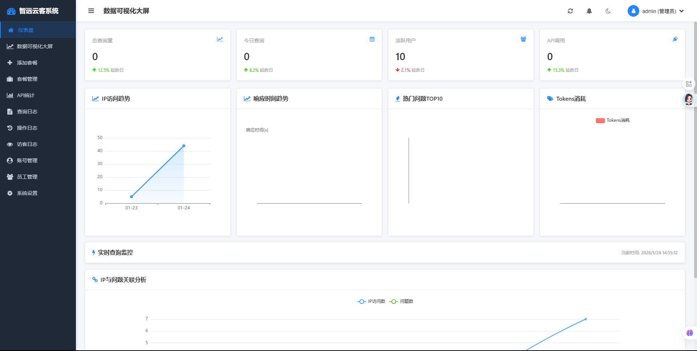 | 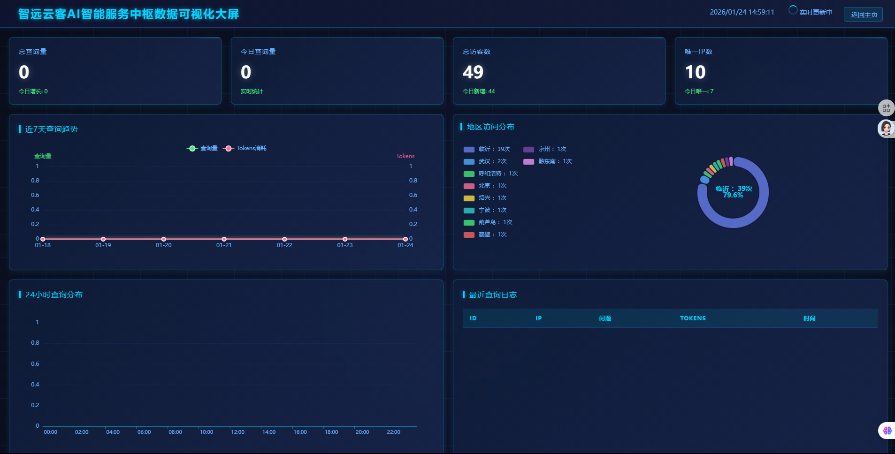 |
| 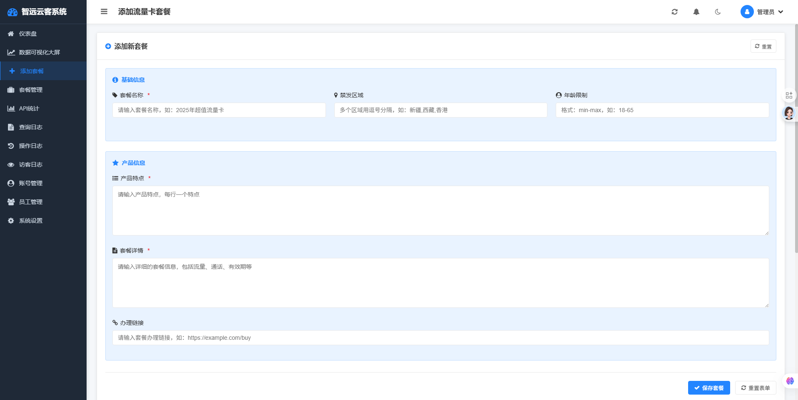 | 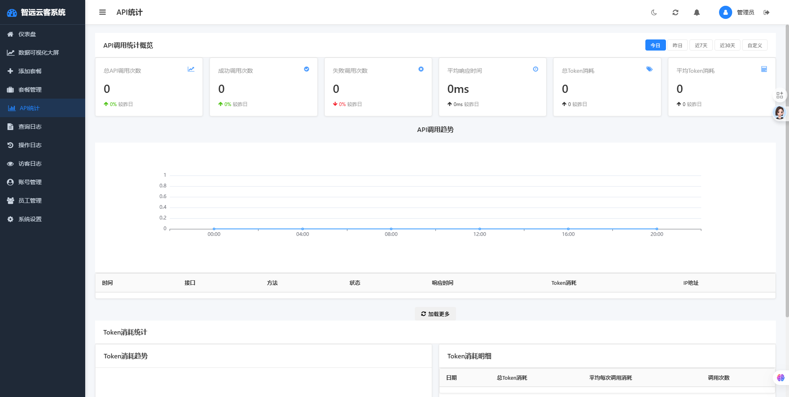 |
| 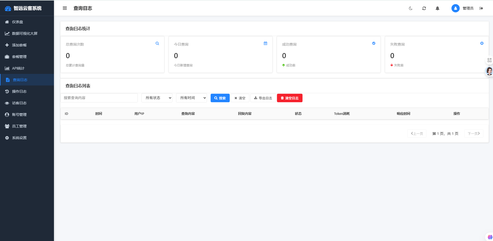 | 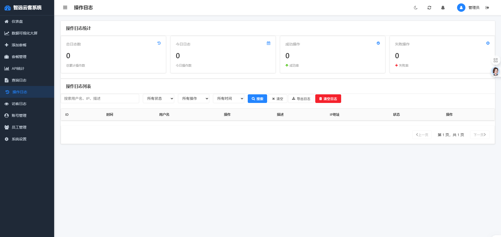 |
| 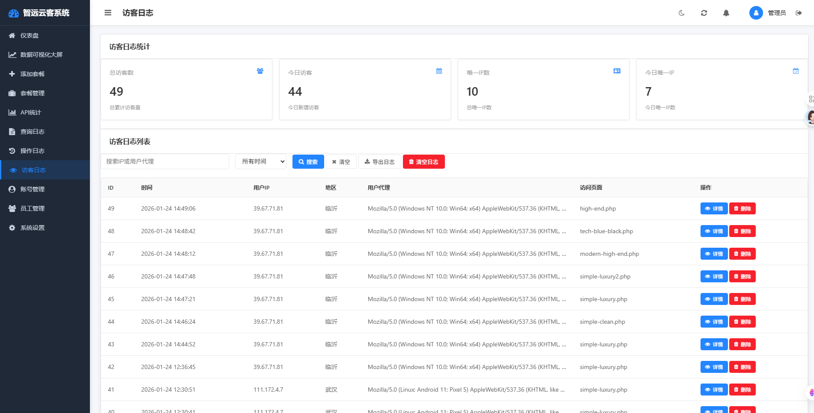 | 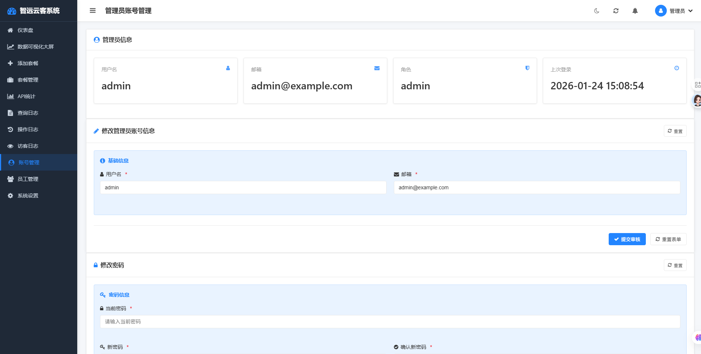 |
| 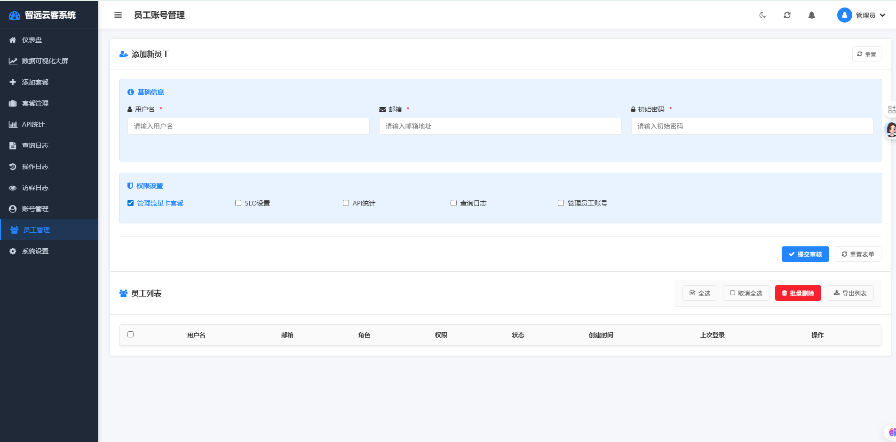 | 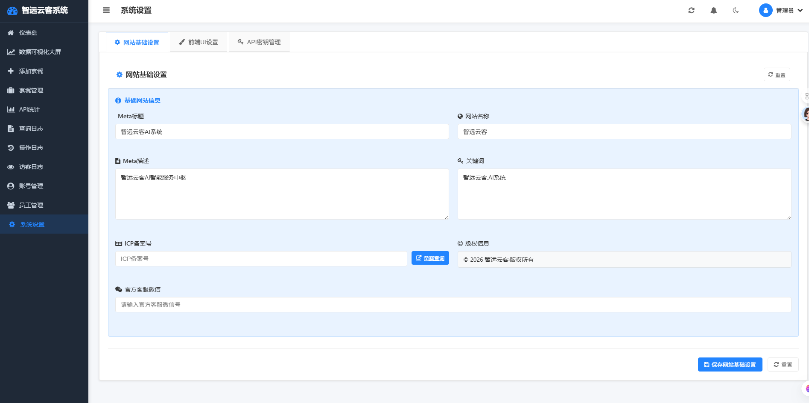 |
| 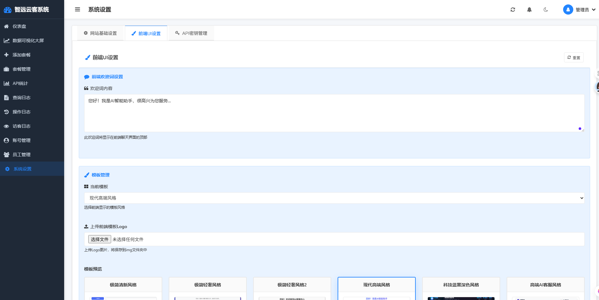 | 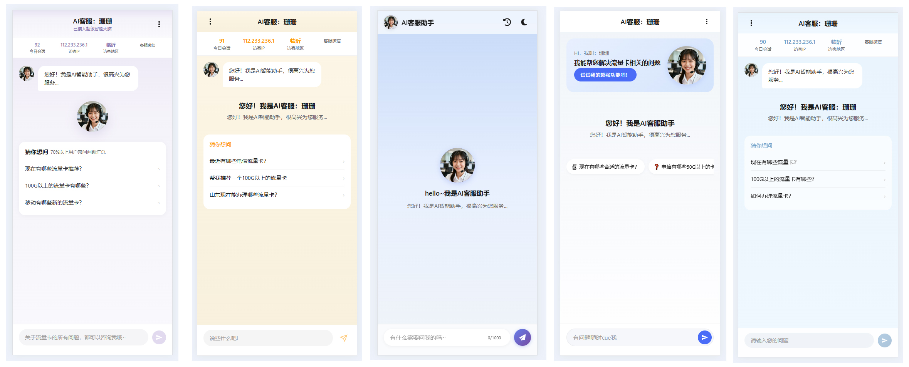 |

---

## 🎯 核心优势

| 优势 | 说明 |
|------|------|
| 🤖 **AI 智能客服** | 基于大模型实现智能对话，理解用户需求 |
| 📚 **知识库管理** | 支持套餐产品批量导入，实时更新 |
| ⚡ **流式响应** | 支持流式输出，体验更流畅 |
| 🔗 **链接直通车** | AI 推荐套餐时自动附带办理链接 |
| 🛡️ **授权保护** | 域名授权绑定，防止盗用 |
| 📊 **数据统计** | 查看 API 调用日志、Token 消耗等 |

---

## 🛠️ 技术栈

- **后端**: PHP 8.0+ | MySQL 5.7+
- **前端**: Vue 3 | Element Plus
- **AI 能力**: 接入多模态大模型 API
- **部署**: 支持 Linux/Windows 服务器

---

## 📱 功能演示

### 演示站


账号：ceshi
密码：测试123

用户只需描述需求（如"北京流量卡推荐"），AI 即可从知识库中匹配合适的套餐产品，并提供办理链接。

### 管理后台
- 套餐管理（增删改查）
- 知识库批量导入
- API 配置
- 数据统计

---

## 📋 版本说明

| 版本 | 说明 |
|------|------|
| 基础版 | 基础 AI 对话功能 |
| 专业版| 高级功能 + 数据统计 |
| 旗舰版 | 完整功能 + 安装服务 |

---

## 🚀 安装部署

### 环境要求

- PHP 8.0 或更高版本
- MySQL 5.7 或更高版本
- Composer 依赖管理
- 支持 URL Rewrite（Apache/Nginx）

### 快速部署

准备一台云服务器和域名，2核2G以上云服务器（轻量云服务器也可以）

```bash
# 1. 上传源码到服务器

# 2. 配置数据库
# 导入数据库文件 zhiyuanyunke.sql

# 3. 修改配置文件
# config/database.php - 数据库连接
# config/license.php - 授权配置

# 4. 访问安装
# 打开域名按提示完成安装
```

### Nginx 配置参考

```nginx
location / {
    try_files $uri $uri/ /index.php?$query_string;
}

location ~ \.php$ {
    fastcgi_pass unix:/var/run/php/php8.0-fpm.sock;
    fastcgi_param SCRIPT_FILENAME $document_root$fastcgi_script_name;
    include fastcgi_params;
}
```

---

## 📂 目录结构

```
智远云客AI客服/
├── admin/                         # 管理后台
│   ├── login.php                 # 管理员登录页面
│   ├── logout.php                # 退出登录
│   ├── dashboard.php             # 管理控制台
│   ├── dashboard-visual.php      # 数据可视化看板
│   ├── packages.php              # 套餐管理（增删改查）
│   ├── add-packages.php          # 添加/编辑套餐
│   ├── admin-accounts.php        # 管理员账号管理
│   ├── settings.php              # 系统设置
│   ├── api-stats.php             # API调用统计
│   ├── license-info.php          # 授权信息查看
│   ├── reset-password.php        # 重置密码
│   ├── save-template.php         # 保存前端模板配置
│   ├── get-template-data.php     # 获取模板数据
│   ├── update-logs-data.php      # 更新日志数据
│   ├── captcha.php               # 验证码生成
│   ├── includes/
│   │   └── auth.php              # 权限验证（登录检查）
│   ├── fonts/                    # 字体文件
│   └── styles.css                # 后台样式
│
├── api/                          # API接口
│   ├── index.php                 # AI对话API（非流式）
│   ├── stream.php                # AI流式对话API
│   ├── admin.php                 # 后台管理API
│   ├── check_update.php          # 检查更新
│   └── do_update.php             # 执行在线更新
│
├── config/                       # 配置文件
│   ├── db.php                    # 数据库连接
│   ├── database.php              # 数据库配置
│   ├── license.php               # 授权验证
│   └── version.php               # 版本信息
│
├── templates/                   # 前端页面模板
│   ├── simple-clean.php          # 简洁清新风格
│   ├── simple-luxury.php         # 简约奢华风格
│   ├── simple-luxury2.php        # 简约奢华风格2
│   ├── high-end.php              # 高端风格
│   ├── modern-high-end.php       # 现代高端风格
│   └── tech-blue-black.php       # 科技蓝黑风格
│
├── img/                         # 图片资源
│   ├── logo.png                 # 网站Logo
│   ├── simple-clean.png          # 模板预览图
│   ├── simple-luxury.png         # 模板预览图
│   ├── simple-luxury2.png        # 模板预览图
│   ├── high-end.png              # 模板预览图
│   ├── modern-high-end.png       # 模板预览图
│   └── tech-blue-black.png       # 模板预览图
│
├── uploads/                     # 上传文件目录
│   └── *.csv                    # 批量导入的套餐数据
│
├── cache/                       # 缓存目录（自动生成）
│
├── admin/fonts/                 # 后台字体
│
├── index.php                    # 前端入口（用户访问页面）
├── install.php                  # 一键安装程序
├── script.js                    # 前端JavaScript
├── styles.css                   # 前端样式
├── .htaccess                    # Apache伪静态配置
│
├── zhiyuanyunke.sql             # 数据库文件（含数据）
├── zhiyuanyunke_clean.sql       # 数据库文件（空数据）
└── traffic_card_template.csv    # 套餐导入模板
```

---

## ❓ 常见问题

**Q: 如何获取 API Key？**
> A: 系统需要接入 AI 大模型 API，可在后台配置您的 API Key。

**Q: 支持哪些 AI 模型？**
> A: 目前支持deepseek、qwen、kimi、minimax、Glm等等主流大模型。

**Q: 可以修改知识库内容吗？**
> A: 可以，在后台管理系统中可以添加、编辑、删除套餐产品。

---

## 📞 联系客服

- 📧 邮箱：ai@zhiyuantongxin.cn
- 🌐 官网：http://zhiyuanyunke.zhiyuantongxin.com
- 💬 微信：zytx-03

---

## Star History

[](https://www.star-history.com/#zuzhiyuan521/zhiyuanyunke-AI-kefu&Date)

<div align="center">

**⭐ 如果这个项目对你有帮助，欢迎 Star！**

Copyright © 2024 智远云客. All Rights Reserved.

</div>
